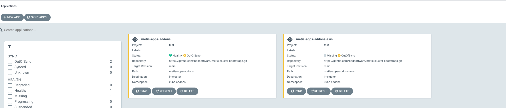

# metis-cluster-bootstraps
Cluster bootstraps for GitOps based on argocd

## Repo Structure

This repository is structured into folders containing helm charts.
Each chart is a collection of argo application crd definitions that related to the installation of toolsets and workloads

## Chart Structure

### **Tempaltes:**

- **Argo Applications**
  
  This folder contains the argo applications that would be deployed as part of
- **config**
  
  This contains the project definitons  for the argo project
  This  contains the argo defintions for the namespaces kube-addons

- **RBAC**
  
  This contains the rbac configs for the kube-addons ns

## Metis Argo Application sets

The metis argo applications sets contain argo applciaiton sets that will , upon application inot the cluser would result int he creation of various
argo application based on the folder structure and file directory pattern defined in the applicaton set.

Eg the [metis-applicationset-addons.yaml](../metis-argo-applicationsets/metis-applicationset-addons.yaml) bellow would result in 2 applications created in the targeted cluster based on the directories corresponting to charts or manifests
filtered   metis-app-addons*


```

ls -ltr | grep  metis-apps-addons
drwxr-xr-x   6 kanzi  staff   192 Jul 22 07:33 metis-apps-addons
drwxr-xr-x   6 kanzi  staff   192 Jul 22 07:35 metis-apps-addons-aws

```

```


apiVersion: argoproj.io/v1alpha1
kind: ApplicationSet
metadata:
  name: metis-kube-adddons
  namespace: argocd
spec:
  generators:
    - git:
        repoURL: https://github.com/bbdsoftware/metis-cluster-bootstraps.git
        revision: HEAD
        directories:
          - path: "metis-apps-addons*"
  template:
    # This is a template Argo CD Application, but with support for parameter substitution.
    metadata:
      name: '{{path.basename}}'
    spec:
      project: test
      source:
        repoURL: https://github.com/bbdsoftware/metis-cluster-bootstraps.git
        targetRevision: main
        path: '{{path}}'
      destination:
        server: https://kubernetes.default.svc
        namespace: kube-addons


```

