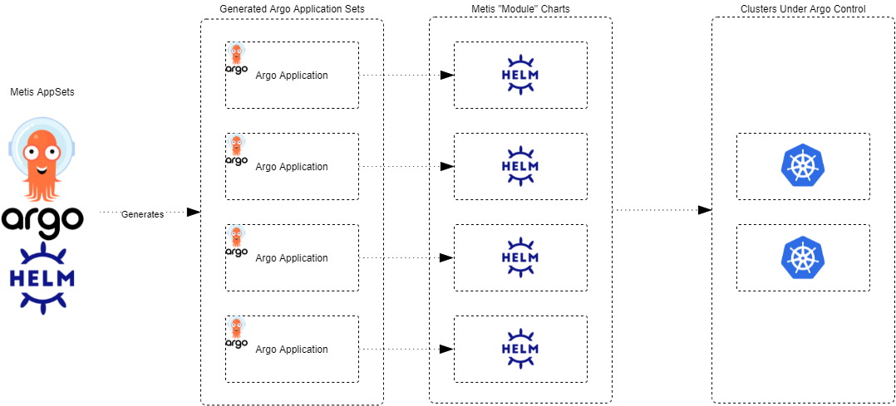

# Introduction
[Documentation Site](https://bbdsoftware.github.io/metis-cluster-bootstraps/)
Gitops with ArgoCd based cluster boostrapping.

# PreRequisites
- K8 cluster eg [kind](https://kind.sigs.k8s.io/docs/user/quick-start/)
- Installed [kubectl](https://kubernetes.io/docs/tasks/tools/) command-line tool
- Installed kubectl [krew](https://krew.sigs.k8s.io/docs/user-guide/setup/install/) package manager
- Installed [kubectx](https://github.com/ahmetb/kubectx) power tools for kubectl
- Installed [helm3](https://helm.sh/docs/intro/install/)
- Installed [Argo + Argo ApplicationSets controller](https://argocd-applicationset.readthedocs.io/en/stable/Geting-Started/)

# Recommend Videos and Reading
- ArgoCD GIT Ops
    - https://www.youtube.com/watch?v=vpWQeoaiRM4
    - https://argoproj.github.io/argo-cd/getting_started/
- OAM
    - https://www.youtube.com/watch?v=2CBu6sOTtwk&t=620s
- Crossplane:
  - https://www.youtube.com/watch?v=yrj4lmScKHQ
  - https://www.youtube.com/watch?v=n8KjVmuHm7A&t=1248s
  - https://blog.crossplane.io/why-crossplane-is-so-exciting/   

# Overview

This repo is organised in an argo app of apps pattern leveraging argo application sets to provision and install various helm charts and capabilities into the 
targeted kubernetes clusters

- When the metis app charts are installed either as manifests, or helm this will result in the creation of various argo application sets configured with cluster gen
- These application sets mapping to the metis "chart modules" will create argo applications
- Each application created represent a toolset,operator or workload that will be provisioned into the cluster/s provisioned for a capability

# Repo Structure

There are two folders each containing helm charts used for installing various argocd CRDs.

##charts-modules
These are a collection  of Helm  Charts organised as "modules". Each chart module is a collection of argo applications, ArgoCD config and namespaces config for various related addons , operator and kubernetes workloads.

see [Chart Modules](charts/modules/main.md)

## charts-bootstrap

## metis application sets

The metis appset chart contains a collection of argo [applicationSets](https://argoproj.github.io/argo-cd/user-guide/application-set/)

The metis argo applications sets will generate argo applications based of the helm charts in this repo.

# Contributing
See [official documentation](http://127.0.0.1:8000/Contributing/AddingApplications/)
